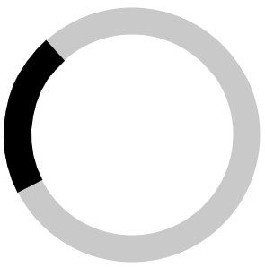
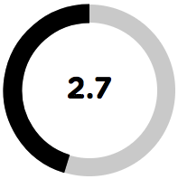
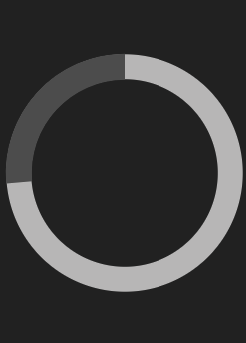
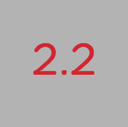
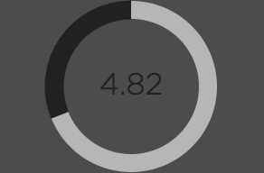

# Timer Progress
Circular timer progress bar based on SVG. Implemented in native JavaScript. Tested in Google Chrome, Mozilla Firefox, Safari, Microsoft Edge and Opera.

## Installation
To use the timer progress bar put ```<script src="timer-progress.min.js"></script>``` inside the ```<head>``` tag of your HTML file. The file is located in the ```dist``` directory.

### Demo
A demo of the functionality is included in the project. To view the demo run ```demo/demo.html```.

## Usage
You can use the timer by creating a TimerProgress object and calling ```run``` function to start the execution. See [functions](#functions) for additional information.

Every TimerProgress class instance needs to be provided with an SVG container object, which functions as a placeholder for other SVG elements:
```html
<svg id="container"></svg>
```

### Examples
- An example of a timer that runs infinitely:

```javascript
var timer = new TimerProgress({
    'container': document.getElementById('container')
});
timer.run('inf');
```



- An example of a timer that runs for 5 seconds and displays the number of seconds left (color of text changes to alert color with only 2 seconds left) in the middle of the circle with additional options specified ([more](#options)):

```javascript
var timer = new TimerProgress({
    'container'        : document.getElementById('container'),
    'width-container'  : 200,
    'height-container' : 200,
    'font-family'      : 'GothamRounded-Bold'
});
timer.run(5000, 2000);
```



- An example of a timer that runs for 8 seconds without any text in the middle of the circle with additional options specified ([more](#options)):

```javascript
var timer = new TimerProgress({
    'container'        : document.getElementById('container'),
    'width-container'  : 250,
    'height-container' : 350,
    'stroke-width'     : 25,
    'color-container'  : '#2c2c2c',
    'color-circle'     : '#c4c3c3',
    'color-path'       : '#5e5e5e'
}, 0, false);
timer.run(8000);
```



- An example of a timer that runs for 6 seconds with a hidden circle and displaying the number of seconds left (with 1 decimal place; color of text changes to alert color with only 2.5 seconds left) in the middle of the circle with additional options specified ([more](#options)):

```javascript
var timer = new TimerProgress({
    'container'        : document.getElementById('container'),
    'width-container'  : 150,
    'height-container' : 150,
    'color-container'  : '#c0c0c0',
    'color-alert'      : '#dc143c',
    'font-size'        : 50,
    'font-family'      : 'GothamRounded-Book'
}, 1, true, false)
timer.run(6000, 2500);
```



- An example of a timer that runs for 7 seconds and displays the number of seconds left (with 2 decimal places) in the middle of the circle with additional options specified ([more](#options)):

```javascript
var timer = new TimerProgress({
    'container'        : document.getElementById('container'),
    'width-container'  : 300,
    'height-container' : 200,
    'stroke-width'     : 20,
    'color-container'  : '#5e5e5e',
    'color-circle'     : '#c4c3c3',
    'color-path'       : '#2c2c2c',
    'color-text'       : '#2c2c2c',
    'font-family'      : 'GothamRounded-Light'
}, 2);
timer.run(7000);
```



### <a name="functions">Functions</a>

#### Constructor
The **constructor** of the TimerProgress class initializes the timer.

```javascript
TimerProgress(options, nDecimals = 0, displayText = true, displayCircle = true)
```

Parameters:

1. <a name="options">_options_</a> object may contain the following attributes:
  * _container_: an SVG object, which functions as a placeholder for other SVG elements (required),
  * _width-container_: width of the SVG placeholder in px (optional; default: 300px),
  * _height-container_: height of the SVG placeholder in px (optional; default: 300px),
  * _stroke-width_: width of the timer progress bar in px (optional; default: 1/10 of the shortest of the container's dimensions),
  * _color-container_: background color of the placeholder SVG element (optional; default: color inherited from parent),
  * _color-circle_: stroke color of the underlying circle SVG element (optional; default: lightgray),
  * _color-path_: stroke color of the path SVG element (optional; default: black),
  * _color-text_: fill color of the text SVG element (optional; default: black),
  * _color-alert_: fill color of the text SVG element when time is under 3 seconds (optional; default: red),
  * _font-size_: size of the text font in px (optional; default: 1/6 of the shortest of the container's dimensions),
  * _font-family_: font family of the text font (optional; default: sans-serif)
2. _nDecimals_: number of decimals of the text representing the time left (optional; default: 0)
3. _displayText_: flag indicating whether the text in the middle of the circle representing the time left (in seconds) is displayed (optional; default: true)
4. _displayCircle_: flag indicating whether the circle indicating progress is displayed (optional; default: true)

#### Run
The **run** function of the TimerProgress class start the execution of the timer.

```javascript
run(time, alertTime = 0)
```

Parameters:

1. _time_:  number of milliseconds defining the timer duration (if 'inf', then the timer will be executed for indefinite duration; required)
2. _alertTime_: number of milliseconds defining how much time before the end of the timer should the text in the middle of the circle change its color (optional; default: 0)

#### Pause
The **pause** function of the TimerProgress class pauses the execution of the timer.

```javascript
pause()
```

#### Resume
The **resume** function of the TimerProgress class resumes the execution of the timer.

```javascript
resume()
```

#### Is Running
The **isRunning** function of the TimerProgress class tells whether the timer is already running.

```javascript
isRunning()
```

#### Is Paused
The **isPaused** function of the TimerProgress class tells whether the timer is already paused.

```javascript
isPaused()
```
